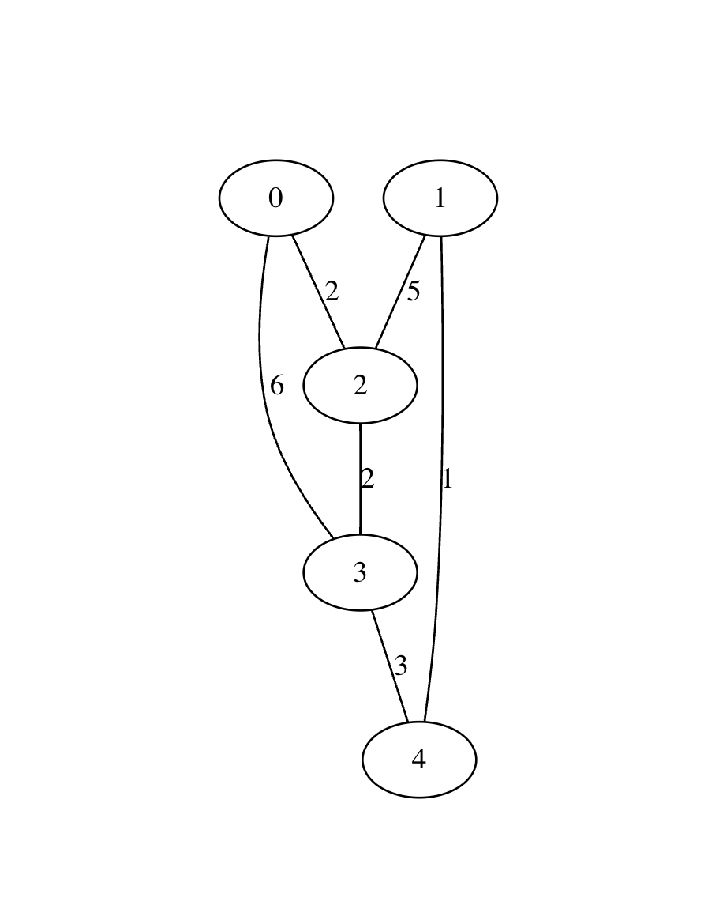
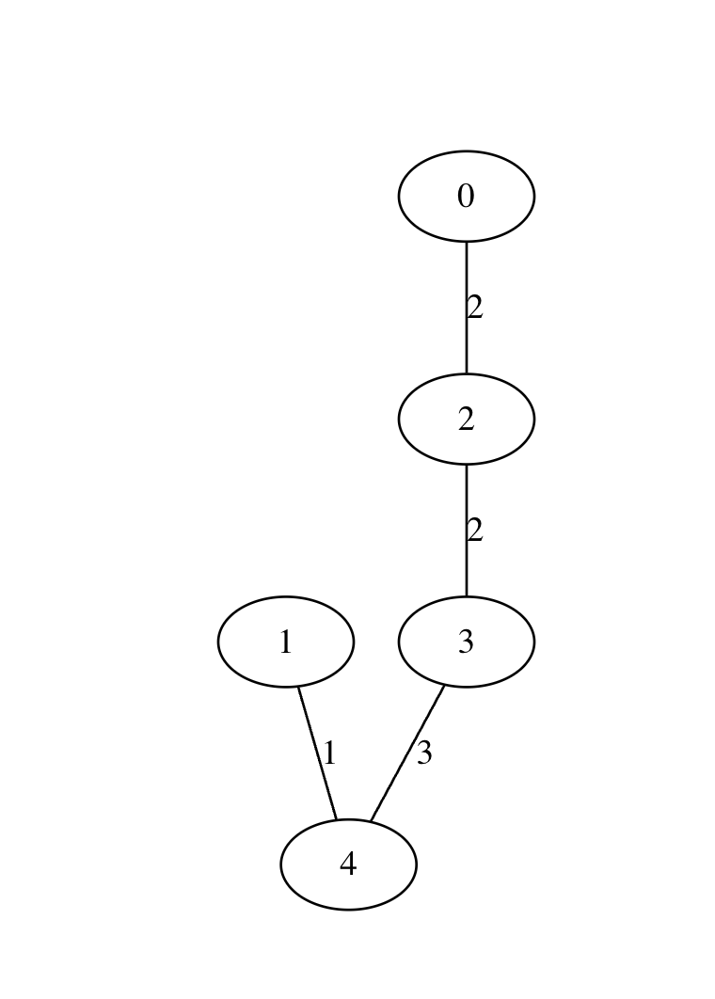

# MST Kruscal Algorithm


Simple implementation of Kruscal algorithm to find the MST (minimum spanning tree). 

Inspired in [this](kruscal.pdf) IME USP Homework

*GRAPH G* 




*MST of G*



## Compile and run
### Makefile
```shell
$ ~ make
```
Will genarate a binary called `kruscal`
```shell
$ ~ ./kruscal
```